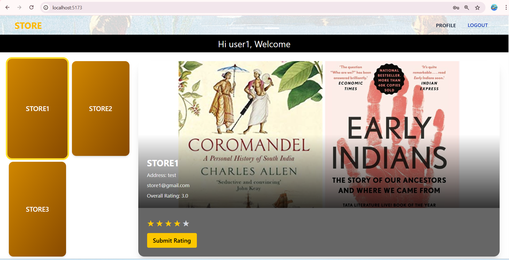
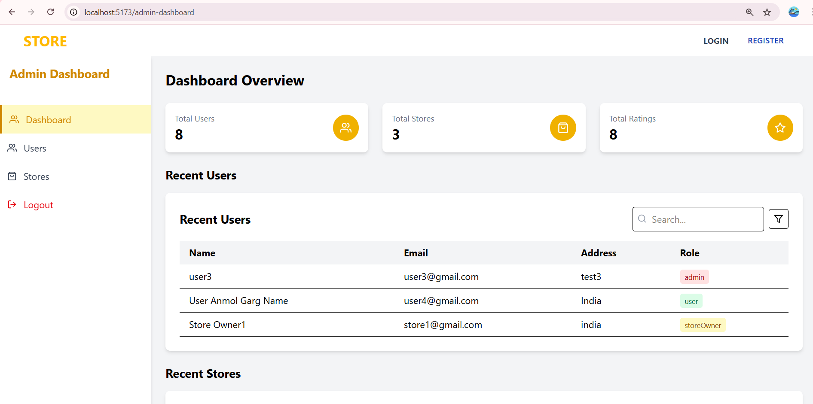
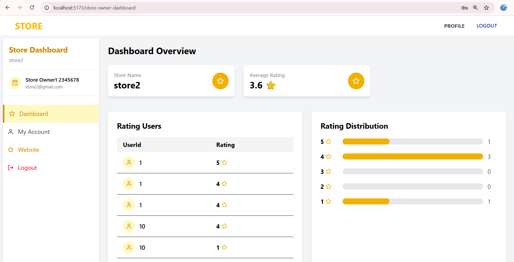

# FullStack Intern Coding Challenge

A web application that allows users to submit ratings for stores registered on the platform. The ratings should range from 1 to 5.
A single login system should be implemented for all users. Based on their roles, users will have access to different functionalities upon logging in.
## 📸 UI Preview

### 🔹 Web Application - Overview

### 🔹 Admin Dashboard - Overview

### 🔹 Store Owner Dashboard - Overview

---

## ⚙️ Tech Stack

This Web Application can be implemented with:

● Backend: NodeJs, ExpressJs

● Database: PostgreSQL

● Frontend: ReactJs

---

